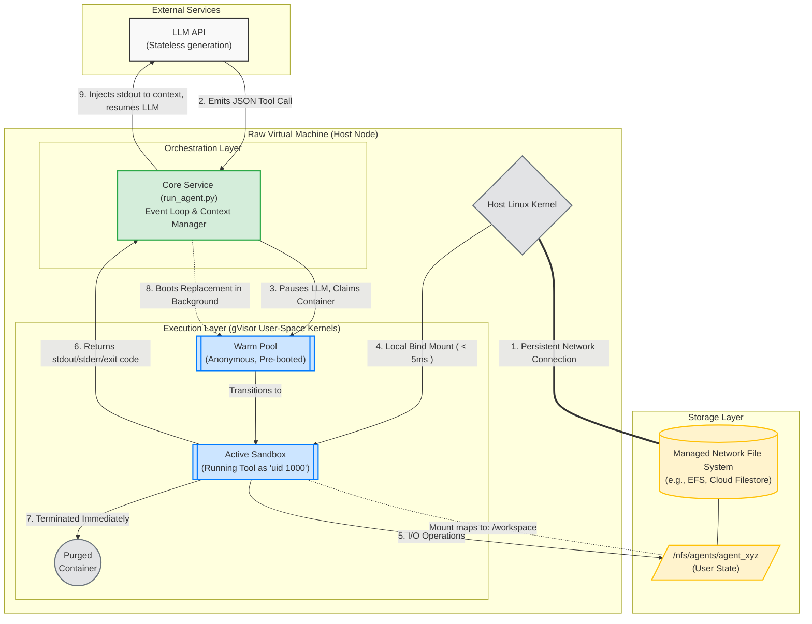

# Prompt Intent

## Multi-Tenant Agent Runtime Mental Model

The proposed runtime model separates persistent agent state from disposable execution sandboxes:

- User and agent workspaces live in durable network-backed storage, mounted once at the host layer.
- Raw VMs act as latency-sensitive host nodes so the system can avoid slow cloud control-plane storage attachment paths during tool execution.
- A host-local orchestrator maintains a warm pool of anonymous, pre-booted isolated sandboxes.
- Each tool invocation claims a clean sandbox, attaches only the relevant agent workspace, runs with reduced privileges, then destroys the sandbox.
- The design goal is low-latency tool startup, strong tenant isolation, minimal cross-run state drift, and persistent user-controlled state independent of compute lifecycle.

Key tension to evaluate: the design optimizes for fast ephemeral execution, but it must still preserve the product’s sovereignty and safety constraints: tenant workspaces cannot leak across boundaries, cloud infrastructure must remain replaceable, and the system must be operable enough for non-technical users.

