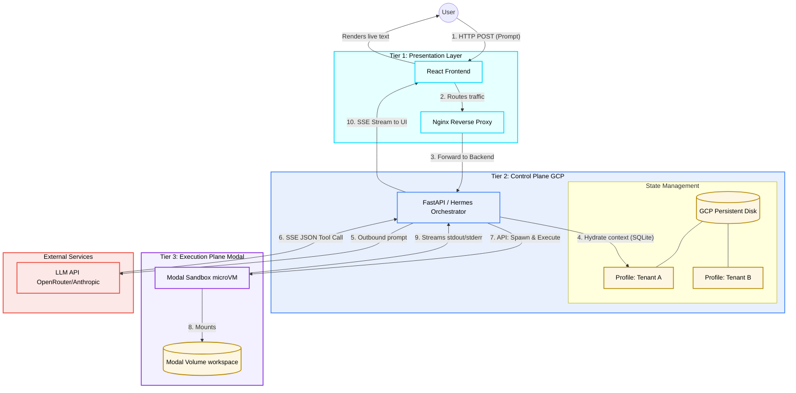

# Prompt Intent

## Current Runtime Direction (2026-04-08)

The current design direction moves from host-managed microVM orchestration toward a split control-plane/execution-plane architecture:

- Tier 1 (Presentation): React UI behind Nginx.
- Tier 2 (Control Plane on GCP): FastAPI + Hermes orchestrator handles user sessions, context hydration, model calls, tool routing, and stream fanout.
- Tier 2 state: tenant profiles are persisted on GCP-backed disk (SQLite on Persistent Disk for now).
- Tier 3 (Execution Plane on Modal): per-task sandbox execution in Modal sandboxes, with workspace state on Modal Volumes.
- External model providers remain stateless LLM APIs (OpenRouter/Anthropic/etc.).

Primary intent:
- Keep orchestration and identity in Sutra control plane.
- Keep code execution isolated and disposable.
- Keep tenant state durable and scoped per profile.
- Stream live tool output and model output back to UI with minimal latency.

Key constraints to preserve while implementing:
- True multi-tenancy by default (no cross-tenant workspace exposure).
- Strong separation between long-lived orchestrator state and short-lived tool runtime.
- No hidden platform lock-in in core data model or API contracts.
- Non-technical-user usability: login and immediately usable web flow.

